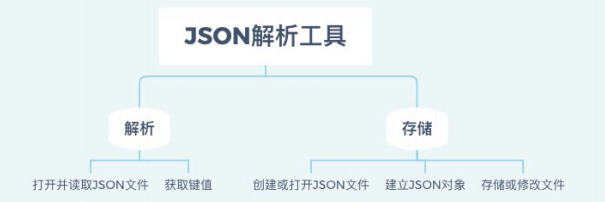
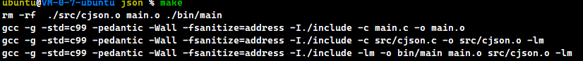
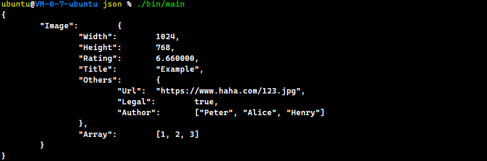
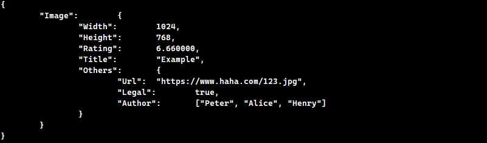
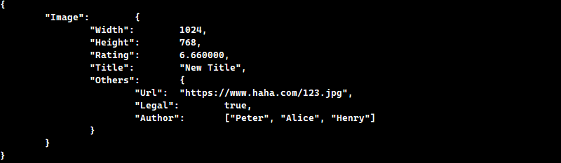
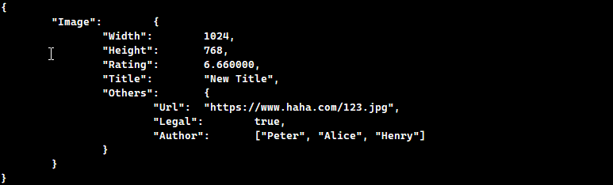

### 背景

JSON(JavaScript Object Notation) 是⼀种轻量级的数据交换格式。  JSON采⽤完全独⽴于语⾔的⽂本格式。

结构：

- “名称/值”对的集合（A collection of name/value pairs）
- 值的有序列表（An ordered list of values）

格式示例

```json
{
"glossary": {
	"title": "example glossary",
 		"GlossDiv": {
 			"title": "S",
 			"GlossList": {
 				"GlossEntry": {
 					"ID": "SGML",
 					"SortAs": "SGML",
					"GlossTerm": "Standard Generalized Markup Language",
 					"Acronym": "SGML",
 					"Abbrev": "ISO 8879:1986",
 					"GlossDef": {
 						"para": "A meta-markup language.",
 						"GlossSeeAlso": ["GML", "XML"]
 					},
 					"GlossSee": "markup"
 				}
 			}
 		}
	}
}
```


### 目标

使用C语言解析、存取、保存 JSON 数据


### 功能模块

- JSON文件读取与写入
- JSON数据解析




### 架构方式

Makefile 多文件处理


### 实现内容

> 运行测试
>
> ```shell
> $ make
> $ ./bin/main
> ```



#### JSON结构体创建

> 测试完整程序为，根目录下 main.c 文件。

```c
	...   
	int int_arr[] = {1,2,3};
    const char *s_arr[3] = {"Peter", "Alice", "Henry"};
    
    JNODE_p root = create_object();
    JNODE_p img = create_object();
    JNODE_p info = create_object();
    JNODE_p e_arr = json_int_array(int_arr, sizeof(int_arr) / sizeof(int));
    JNODE_p a_arr = json_string_array(s_arr, 3);
    // Add
    (void)json_add_to_object(root, "Image", img, 1);
    (void)json_add_int(img, "Width", 1024);
    (void)json_add_int(img, "Height", 768);
    (void)json_add_double(img, "Rating", 6.66);
    (void)json_add_string(img, "Title", "Example");
    (void)json_add_to_object(img, "Others", info, 1);
    (void)json_add_string(info, "Url", "https://www.haha.com/123.jpg");
    (void)json_add_true(info, "Legal");
    (void)json_add_to_object(img, "Array", e_arr, 1);
    (void)json_add_to_object(info, "Author", a_arr, 1);
    (void)output_json(root, stdout);
    ...
```

结构体由 Object 为基础节点，通过指针关联同级prev、next节点，次级child节点。

定义的基本类型有：

```c
enum {
    J_NULL = 0,
    J_True,
    J_False,
    J_Int,
    J_Double,
    J_String,
    J_Array,
    J_Object
};
```

结构体构建效果




#### 删除节点

```c
    // Delete 
    (void)json_del_from_object(root, "Array");
    (void)output_json(root, stdout);
```




#### 修改节点

```c
    // Modify
    JNODE_p repl = create_string("New Title");
    json_replace_object(root, "Title", repl);
    (void)output_json(root, stdout);
```




#### 查找节点

```c
    // Search
    JNODE_p target = NULL;
    target = json_get(root, "Url");
    if (!target)
        printf("No result");
```


#### 文件保存与读取

```c
void test_json_to_file(JNODE_p root, char *filename) {
    FILE *out = fopen(filename, "wb");
    if (out) {
        output_json(root, out);
    }
    fclose(out);
    return;
}

JNODE_p test_json_read(char *filename) {
    FILE *in = fopen(filename, "rb");
    JNODE_p root = NULL;
    if (in)
        root = read_json(filename);
    if (root == NULL)
        puts("Failed to read json file .\n");
    fclose(in);
    return root;
}
```

读取结果




### 后记

程序实现参考了 [cJSON](https://github.com/DaveGamble/cJSON)，但是其中删、该、查的实现有点僵硬，只是处理同一层的节点。所以这里改成递归查找。

另外告诉自己，makefile编写不完善时，千万谨慎运行。尤其在源代码文件没有备份时，小心 clean 中的 rm！这直接导致整个源码文件重新写了第二次，血压飙升。

